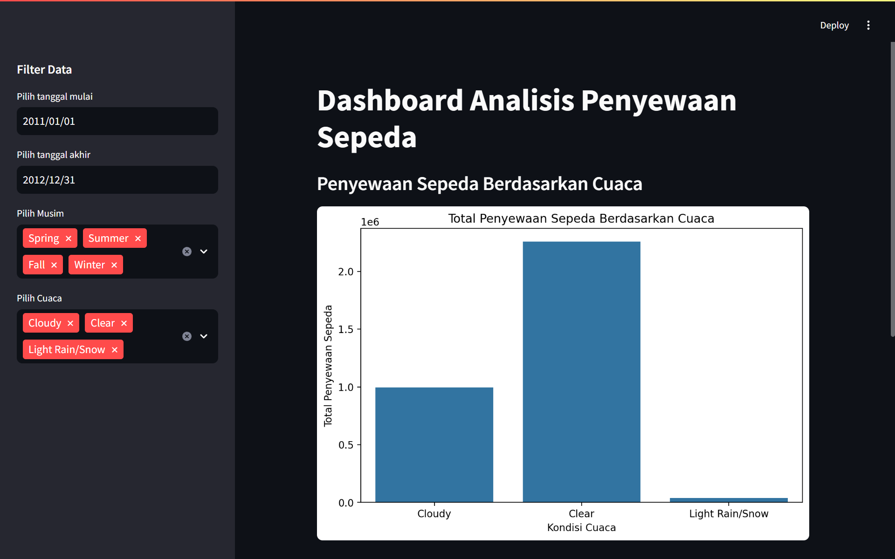
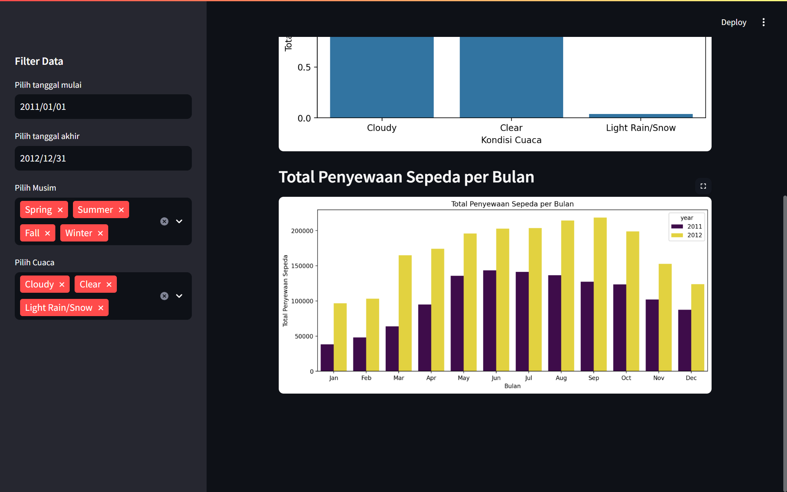

# Dashboard Analisis Penyewaan Sepeda

Dashboard ini dibuat menggunakan **Streamlit** untuk menganalisis pengaruh kondisi cuaca terhadap jumlah penyewaan sepeda serta mengidentifikasi pola musiman atau tren waktu dalam penggunaan sepeda selama tahun 2011 dan 2012.

## **Struktur Folder**
```
submission
├───dashboard
| └───dashboard.py
├───data
| ├───day.csv
| └───hour.csv
├───notebook.ipynb
├───README.md
└───requirements.txt
└───url.txt

```
## **Langkah-langkah Menjalankan Dashboard**

### **1️⃣ Clone Repository (Opsional)**
Jika Anda ingin menjalankan dari repository GitHub, gunakan perintah berikut:
```sh
git clone https://github.com/username/repository.git
cd repository
```

### **2️⃣ Buat Virtual Environment**
Disarankan untuk menggunakan virtual environment agar dependensi terisolasi:

#### **Windows**
```sh
python -m venv venv
venv\Scripts\activate
```
```
mkdir proyek_analisis_data
cd proyek_analisis_data
pipenv install
pipenv shell
pip install -r requirements.txt
```

### **3️⃣ Install Dependensi**
Pastikan semua dependensi sudah diinstal dengan menjalankan perintah berikut:
```sh
pip install -r requirements.txt
```

### **4️⃣ Jalankan Aplikasi Streamlit**
Jalankan perintah berikut untuk menjalankan dashboard:
```sh
streamlit run app.py
```
Setelah dijalankan, Anda akan mendapatkan link seperti ini:
```
Local URL: http://localhost:8501
```
Biasanya otomatis langsung mengarah ke browser dan terbuka URL Local diatas.

## **Fitur dalam Dashboard**
✅ **Filter Rentang Waktu** – Pilih rentang waktu untuk analisis
✅ **Analisis Musim** – Lihat pengaruh musim terhadap jumlah penyewaan sepeda
✅ **Tren Waktu Sehari** – Analisis pola penyewaan berdasarkan jam
✅ **Kondisi Cuaca** – Pengaruh cuaca terhadap penyewaan sepeda


